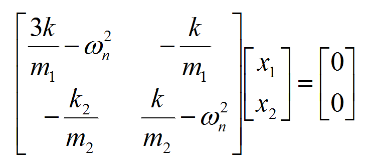

# Midterm 2 MENG602/438
Date: April 30th 2020
Time: 5:45pm - 11:45pm

## Student's information
 
<form id="percentageBiz" method="post">
<input type="text" id="name" placeholder = "Name">
<input type="text" id="nyitid" placeholder = "NYIT ID">
<input type="submit" onclick="return getp()" value="Generate Parameters"> 
</form>
 
The question is for student: 

 

## Problem 1 
A set of simultaneous linear algebraic equations results: **A** x **c** = **b** 

**A** = 

 
**b** = 

 

(i)	Use the matrix inverse to solve for the **c**. 
(ii)	Find Euclidean norm of **A** and **A-1** 
(iii)	Calculate matrix condition number using Euclidean norms, and aslo determine how many suspect digits would be needed by solving this system with accuracy. 

## Problem 2 
Determine the solution of the simultaneous nonlinear equations 

Use Newton-Raphson method and employ initial guesses of  
_x1_ = 

test

test
_x2_ = 

(i) Write and calculate Jacobian matrix.  
(ii) Calculate x and y after first iteration and calculate f1 and f2 with updated x1, x2. 
(iii) Calcualte error of approximation, ea (error).  

## Problem 3
Application of Eigenvales and Eigenvectors
Consider the mass spring model to gain insight into the dynamics of structures under the influence of disturbances such as earthquakes.
Figure shows such a model for a two-stroy building. Each floor mass is represented by mi, and each floor stiffness is represented by ki, for i = 1 and 2. The frequencies for the mass vibrations can be determined by solving for the eigenvalues and by applying M_x"_ + _kx_ = 0, which yields

Applying the guess x = x0eiωnt as a solution, we get the following matrix:

where xi represent horizontal floor displacement, and ωn is the natural, or resonant, frequency (radians/s).

Let **_m1_** = **_m2_** = 

 (Kg)
and k = 

 (N/m)

(i) Use eigenvalues to solve for freqencies.
(ii) If mass of floors is unknown, based on the observation, the frequency is 1, what is possiblm m1 mass.

<input type="submit" onclick="return printpdf()" value="Print">
## Submission
Use above print bottom to save your exam sheet to pdf and upload with your solution to **Midterm2 Submission Box** in class's blackboard. Please submit your solution before 11:45pm April 30th 2020. 
 

<input type="text" id="pw1" placeholder="aceess code">
<input type="submit" onclick="return runsol()" value="Generate Solution">

 

